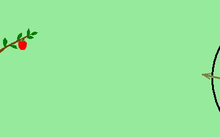

# Visual Basic Animation – Modernized with Python

## Preview

## Project Background
This animation was originally created in **2010** during my university years as a course project using **Visual Basic 6**.

- All characters and scenes were **hand-drawn by me**
- The animation was created using a **frame-by-frame approach**
- Frames were displayed sequentially with simple Visual Basic logic

## Modernization (2026)
Years later, I revisited this project and recreated the animation output using **Python**, generating a GIF from the original frames.

In this version:
- The original image frames were preserved exactly as they were
- Python was used to:
  - filter out non-image files (e.g., `Thumbs.db`)
  - sort frames numerically
  - export an animated GIF

## Files in This Repository
- `animation.gif` — the generated animation preview
- `worm_animation_gif.ipynb` — the notebook used to create the GIF (Google Colab)
- `resimler.zip` — original frame images (archived)

## Technologies Used
- Python
- Pillow (PIL)
- Google Colab / Jupyter Notebook
- Frame-based animation logic
